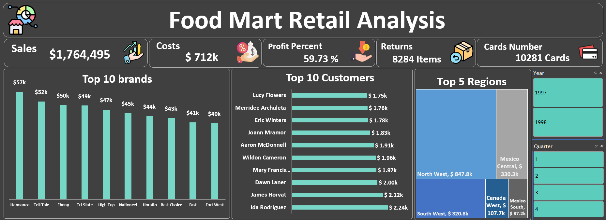

<h1 align="center">🛒 Food Mart Retail Analysis Project</h1>

  

The **Food Mart Retail Analysis** project is a comprehensive **data cleaning, modeling, and visualization** initiative built entirely in **Microsoft Excel**.  
It aims to deliver actionable business insights into sales performance, profitability, customer behavior, and regional trends for a retail business.  
The dashboard consolidates key metrics and KPIs to support data-driven decision-making.

---

## 🧹 Data Preparation & Modeling

Before building the dashboard, extensive **data preprocessing** was performed to ensure data accuracy and consistency:

- **Removed duplicates** to eliminate redundant records.  
- **Dropped unnecessary columns** to simplify the dataset and improve performance.  
- **Created a Calendar Table** covering the entire sales period (1997–1998) for accurate time-based analysis.  
- **Established relationships** between fact and dimension tables such as `Sales`, `Customers`, `Products`, `Stores`, and `Region`.  
- Built **Pivot Tables** as the analytical foundation for the dashboard visualizations.

This process enabled efficient aggregation, dynamic filtering, and accurate time intelligence across the dataset.

---

## 💰 Overview

- **Total Sales**: $1,764,495  
- **Total Costs**: $712k  
- **Profit Percentage**: 59.73%  
- **Returns**: 8,284 items  
- **Number of Loyalty Cards**: 10,281  

The dashboard provides a high-level overview of Food Mart’s financial and operational performance, reflecting a strong profit margin and healthy sales growth.

---

## 📈 Key Sections

### 1. Top 10 Brands
Bar chart showing leading brands by sales volume:
- **Top Brand:** Hermanos ($57k)
- Other notable brands: Tell Tale ($52k), Ebony ($50k), Tri-State ($49k), High Top ($47k), Nationeel ($46k)

→ *Hemasos leads the market, followed by a diverse portfolio of strong brands.*

---

### 2. Top 10 Customers
Horizontal bar chart of highest-spending customers:
- Ranges from **$1.75k to $2.24k**, with **Ida Rodriguez** being the top customer.

→ *Helps identify valuable customers for loyalty and retention strategies.*

---

### 3. Top 5 Regions
- **North West:** $847.8k
- **Mexico Central:** $330.3   
- **South West:** $320.8k  
- **Canda West:** $170.7k
- **Mexico South:** $87.2k 

→ *North West dominates in regional performance.*

---

### 4. Sales Trendline (Monthly)
Sales across 12 months (1997–1998) show a steady increase, peaking in **December ($177.1k)**.  
→ *Indicates strong holiday season performance.*

---

### 5. Elite vs Normal Customers
- **Elite:** 9.59%  
- **Normal:** 90.41%  

→ *Majority of revenue comes from regular customers.*

---

### 6. Sales by Number of Children
Sales peak among families with **2–3 children**, totaling over **$370k** per group.  
→ *Shows correlation between family size and purchase volume.*

---

### 7. Customers by City
Richmond leads with **191 customers**, followed by Shawnee (111) and Downey (110).  
→ *Highlights customer concentration areas.*

---

### 8. Top 10 Stores by Sales
- **Store 13:** $170.4k (highest performing)  
→ *Helps identify top-performing locations.*

---

### 9. Sales by Yearly Income
Sales are strongest among customers earning **below $100k/year**, accounting for the largest share of total revenue.  
→ *Shows mid- to lower-income customers are the core market.*

---

### 10. Top 10 Product Returns
Highest returned products include **Hermanos Red Pepper (17 returns)** and **Oranges (15)**.  
→ *Potential quality or satisfaction issues to address.*

---

### 11. Profit by Gender
- **Female:** $532.09k  
- **Male:** $520.69k  
→ *Women represent the majority of profit contribution.*

---

### 12. Profit by Occupation
- **Professional:** $342k  
- **Skilled Manual:** $283k  
→ *Professional and skilled manual workers drive most of the profit.*

---

### 13. Profit by Education
- **Partial High School:** $318k  
- **High School Degree:** $311k  
→ *Lower education levels show higher profit contributions.*

---

### 14. Profit by Store Country
- **USA:** 67%
- **Mexico:** 27%
- **Canada:** 6%  
→ *The USA dominates overall profit generation.*

---

## 📊 Tools & Techniques Used

- **Microsoft Excel**
  - Power Query for data cleaning  
  - Power Pivot for data modeling  
  - Pivot Tables & Charts for visualization  
  - Calendar Table for time intelligence  
  - Slicers & Filters for interactivity  

---

## ✅ Conclusion

The **Food Mart Retail Analysis Dashboard** demonstrates how Excel can be used as a powerful BI tool for data-driven decision-making.  
The project achieved a **59.73% profit margin** with **$1.76M total sales**, uncovering key insights such as:

- Dominance of the **North West region**  
- Higher sales among families with **2–3 children**  
- Dependence on **normal customers** for majority of revenue  
- Clear opportunities to reduce **product returns** and improve customer retention

By integrating strong data cleaning, relational modeling, and pivot-driven analysis, this project showcases a complete end-to-end Excel analytics workflow.

---

## 👨‍💻 Team

  <!-- Ahmed -->
  

    <a href="https://github.com/A7med668" target="_blank" style="text-decoration: none; color: #e6edf3;">
      
      <h3 style="margin-top: 10px; color: #58a6ff;">Ahmed Hussein Ali Abdelsalam Hussein</h3>
      
👨‍💻 Data Science Student

      <b style="color: #58a6ff;">🔗 GitHub:</b> 
      A7med668
    </a>
  

  <!-- Omar -->
  

    <a href="https://github.com/omarhamed888" target="_blank" style="text-decoration: none; color: #e6edf3;">
      
      <h3 style="margin-top: 10px; color: #58a6ff;">Omar Hamed Ali AboElsoud</h3>
      
👨‍💻 Data Science Student

      <b style="color: #58a6ff;">🔗 GitHub:</b> 
      omarhamed888
    </a>
  

---
## 📊 Dashboard Preview

